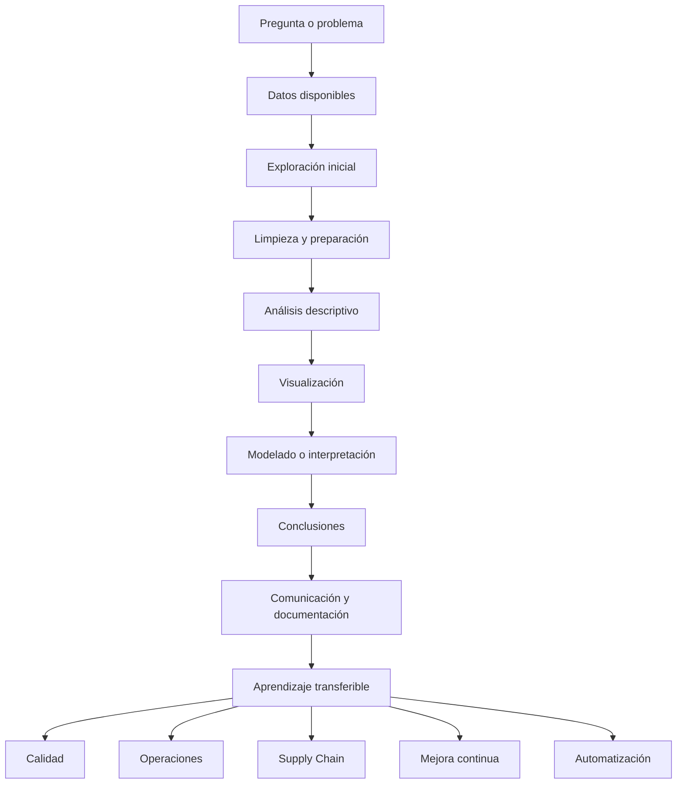
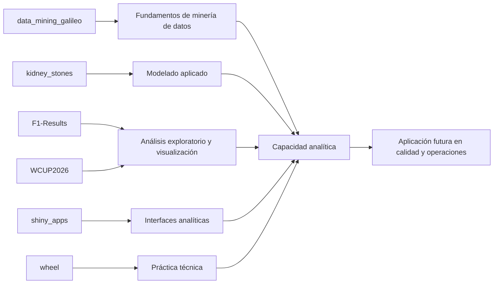
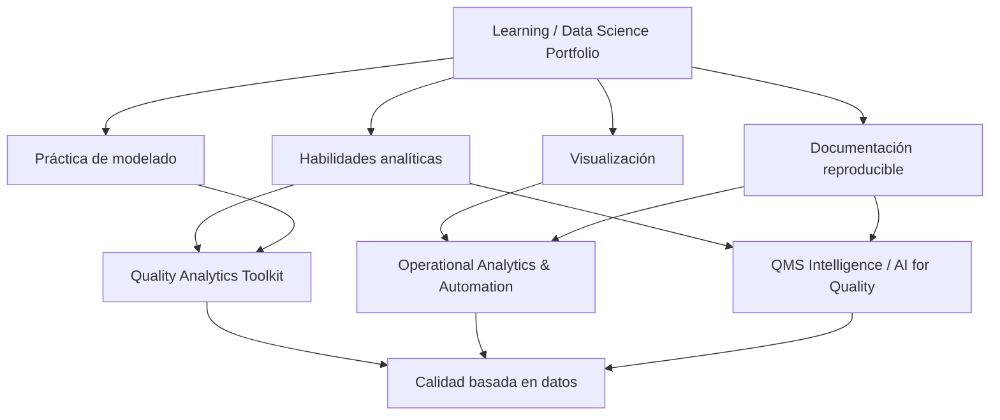

# Learning / Data Science Portfolio

Portafolio de aprendizaje aplicado, análisis de datos y proyectos exploratorios para fortalecer capacidades en analítica, modelado, visualización y toma de decisiones basada en evidencia.

Este repositorio funciona como índice curado de proyectos públicos que documentan prácticas, ejercicios, análisis y experimentos desarrollados en distintas áreas de data science.

El enfoque no está en presentar estos proyectos como productos finales.

El enfoque está en mostrar evolución técnica, capacidad de aprendizaje, manejo de datos, pensamiento analítico y aplicación progresiva de herramientas de ciencia de datos en distintos contextos.

## Propósito

En una trayectoria profesional que conecta calidad, operaciones y analítica, los proyectos de aprendizaje también cumplen una función importante.

Permiten demostrar:

- dominio progresivo de herramientas;
- capacidad para explorar datos;
- criterio para estructurar análisis;
- práctica con modelos y visualizaciones;
- aprendizaje aplicado en distintos dominios;
- capacidad de documentar procesos analíticos;
- transferencia de habilidades hacia problemas operativos reales.

Learning / Data Science Portfolio agrupa proyectos que no necesariamente pertenecen al núcleo de Quality Analytics, pero que ayudan a mostrar crecimiento técnico y amplitud analítica.

## Idea central

El aprendizaje técnico genera más valor cuando se convierte en evidencia visible.

Estos proyectos muestran práctica aplicada en:

1. exploración de datos;
2. limpieza y preparación;
3. análisis descriptivo;
4. visualización;
5. modelado;
6. comunicación de hallazgos;
7. documentación reproducible.

La intención no es competir como portafolio genérico de data science.

La intención es mostrar cómo el aprendizaje en datos fortalece una propuesta profesional más amplia: calidad, operaciones, mejora continua y toma de decisiones basada en evidencia.

## Mapa de repositorios públicos

| Área | Repositorio | Propósito |
|---|---|---|
| Data mining / aprendizaje académico | [data_mining_galileo](https://github.com/fjgonzalezmgt/data_mining_galileo) | Proyecto relacionado con minería de datos, aprendizaje aplicado y análisis desarrollado en contexto académico. |
| Machine learning / clasificación | [kidney_stones](https://github.com/fjgonzalezmgt/kidney_stones) | Proyecto exploratorio aplicado a datos de salud, útil para practicar análisis, preparación de datos y modelos predictivos. |
| Análisis deportivo / visualización | [F1-Results](https://github.com/fjgonzalezmgt/F1-Results) | Proyecto de análisis y visualización de resultados de Fórmula 1, orientado a exploración de datos y presentación de información. |
| Análisis deportivo / eventos | [WCUP2026](https://github.com/fjgonzalezmgt/WCUP2026) | Proyecto relacionado con datos del Mundial 2026, útil para practicar análisis, visualización y estructuración de información. |
| Shiny / aplicaciones exploratorias | [shiny_apps](https://github.com/fjgonzalezmgt/shiny_apps) | Repositorio exploratorio relacionado con aplicaciones Shiny y aprendizaje de interfaces analíticas. |
| Utilidades / práctica técnica | [wheel](https://github.com/fjgonzalezmgt/wheel) | Proyecto pequeño de práctica técnica o exploración de componentes reutilizables. |

## Líneas principales del portafolio

### 1. Aprendizaje académico y minería de datos

Repositorio:

- [data_mining_galileo](https://github.com/fjgonzalezmgt/data_mining_galileo)

Esta línea agrupa proyectos desarrollados como parte de procesos formativos o académicos.

El objetivo es demostrar aprendizaje estructurado en análisis de datos, minería de datos y aplicación de métodos cuantitativos.

Casos de uso típicos:

- exploración de datasets;
- preparación de datos;
- análisis descriptivo;
- práctica de algoritmos;
- generación de reportes;
- comunicación de resultados;
- documentación del proceso analítico.

### 2. Modelado aplicado

Repositorio:

- [kidney_stones](https://github.com/fjgonzalezmgt/kidney_stones)

Esta línea agrupa proyectos orientados a practicar modelado, predicción o clasificación en contextos específicos.

Aunque el dominio no sea calidad industrial, el aprendizaje técnico es transferible.

La práctica con modelos ayuda a desarrollar criterio sobre:

- selección de variables;
- limpieza de datos;
- entrenamiento y evaluación;
- interpretación de resultados;
- limitaciones del modelo;
- riesgo de sobreajuste;
- comunicación de hallazgos.

Casos de uso típicos:

- clasificación;
- análisis exploratorio;
- comparación de modelos;
- preparación de variables;
- evaluación de desempeño;
- documentación de resultados.

### 3. Análisis exploratorio y visualización

Repositorios:

- [F1-Results](https://github.com/fjgonzalezmgt/F1-Results)
- [WCUP2026](https://github.com/fjgonzalezmgt/WCUP2026)

Esta línea agrupa proyectos donde el foco está en explorar información, visualizar patrones y comunicar resultados de forma clara.

El deporte funciona como buen laboratorio de datos porque permite practicar con eventos, rankings, resultados, series de tiempo, comparaciones y visualización.

Casos de uso típicos:

- análisis descriptivo;
- visualización de resultados;
- comparación entre equipos, pilotos o países;
- construcción de tablas resumidas;
- exploración de tendencias;
- comunicación de patrones.

### 4. Aplicaciones analíticas exploratorias

Repositorio:

- [shiny_apps](https://github.com/fjgonzalezmgt/shiny_apps)

Esta línea agrupa prácticas relacionadas con interfaces analíticas.

El objetivo es aprender cómo convertir análisis en aplicaciones más accesibles para usuarios que no necesariamente trabajan directamente con código.

Casos de uso típicos:

- prototipos de aplicaciones;
- dashboards simples;
- interacción con datos;
- visualización dinámica;
- práctica con Shiny;
- experimentación con interfaces.

### 5. Práctica técnica y utilidades

Repositorio:

- [wheel](https://github.com/fjgonzalezmgt/wheel)

Esta línea agrupa repositorios pequeños, pruebas o ejercicios técnicos que ayudan a consolidar habilidades específicas.

No todos los proyectos pequeños deben verse como productos finales.

Algunos cumplen una función de laboratorio: probar ideas, practicar estructuras o entender componentes.

## Arquitectura del aprendizaje

El aprendizaje aplicado en data science puede entenderse como un flujo acumulativo:



La parte más importante no es solo producir un resultado.

La parte más importante es convertir cada proyecto en aprendizaje transferible hacia problemas profesionales reales.

## Relación entre repositorios

Los repositorios de este portafolio se relacionan como una trayectoria de práctica:



La lógica común es practicar habilidades analíticas en contextos diversos para fortalecer la capacidad de abordar problemas más complejos en calidad, operaciones y mejora continua.

## Qué problemas busca resolver este portafolio

### Evidenciar aprendizaje técnico

Muchas habilidades analíticas son difíciles de demostrar solo con un CV.

Los repositorios permiten mostrar práctica real, evolución y capacidad de construir análisis reproducibles.

### Practicar con dominios diversos

Los proyectos no industriales ayudan a practicar análisis sin depender siempre de datos confidenciales de empresa.

Esto permite construir evidencia pública sin exponer información sensible.

### Fortalecer pensamiento analítico

El valor no está solo en usar una librería o modelo.

El valor está en formular preguntas, preparar datos, interpretar resultados y comunicar hallazgos.

### Separar aprendizaje de producto

No todos los repos deben ser productos terminados.

Algunos proyectos existen para aprender, experimentar y documentar progreso.

Esa claridad evita confundir proyectos exploratorios con herramientas profesionales maduras.

### Crear base para proyectos futuros

Las habilidades practicadas aquí pueden transferirse a Quality Analytics Toolkit, QMS Intelligence y Operational Analytics & Automation.

## Qué no busca hacer

Este portafolio no busca:

- presentarse como una suite de productos terminados;
- reemplazar el portafolio principal de calidad y operaciones;
- competir como colección genérica de notebooks;
- mostrar volumen por encima de criterio;
- mezclar proyectos de aprendizaje con herramientas profesionales sin distinguir su propósito;
- ocultar que algunos repos son exploratorios.

La función de este portafolio es mostrar aprendizaje aplicado y evolución técnica.

No debe desplazar la narrativa principal de Quality Analytics.

## Principios de documentación

Los proyectos de esta línea deberían documentarse con una estructura simple:

1. **Contexto**  
   Qué problema, dataset o tema se explora.

2. **Objetivo**  
   Qué pregunta se intenta responder.

3. **Datos**  
   Qué fuente o estructura de datos se utiliza.

4. **Método**  
   Qué análisis, modelo o visualización se aplica.

5. **Resultados**  
   Qué se encontró.

6. **Limitaciones**  
   Qué no puede concluirse.

7. **Aprendizaje transferible**  
   Qué habilidad puede aplicarse después en calidad, operaciones o analítica profesional.

## Flujo típico de trabajo

Un flujo general para estos proyectos puede verse así:

1. Definir una pregunta de análisis.
2. Identificar datos disponibles.
3. Cargar y revisar estructura.
4. Limpiar y transformar datos.
5. Explorar patrones.
6. Visualizar resultados.
7. Aplicar modelo si corresponde.
8. Interpretar hallazgos.
9. Documentar limitaciones.
10. Extraer aprendizaje transferible.

## Ejemplos de preguntas útiles

### Exploración de datos

```text
¿Qué patrones aparecen en los datos antes de aplicar un modelo?
```

```text
¿Qué variables parecen tener mayor relación con el resultado observado?
```

### Modelado

```text
¿Qué tan bien generaliza el modelo fuera de los datos de entrenamiento?
```

```text
¿Qué errores son más relevantes desde el punto de vista práctico?
```

### Visualización

```text
¿Qué gráfico ayuda mejor a entender el comportamiento del fenómeno?
```

```text
¿Qué comparación permite comunicar el hallazgo con mayor claridad?
```

### Aprendizaje transferible

```text
¿Qué habilidad de este proyecto puedo aplicar después a calidad, operaciones o supply chain?
```

```text
¿Qué parte del análisis podría convertirse en una herramienta más operativa?
```

### Documentación

```text
¿Qué necesita saber otra persona para entender, reproducir o revisar este análisis?
```

```text
¿Qué limitaciones debo declarar para evitar conclusiones exageradas?
```

## Relación con Quality Analytics

Learning / Data Science Portfolio complementa las demás líneas de trabajo:

- [Quality Analytics Toolkit](https://github.com/fjgonzalezmgt/Quality-Analytics-Toolkit)
- [QMS Intelligence / AI for Quality](https://github.com/fjgonzalezmgt/QMS-Intelligence-AI-for-Quality)
- [Operational Analytics & Automation](https://github.com/fjgonzalezmgt/Operational-Analytics-Automation)

Mientras esas líneas se enfocan en aplicaciones más directamente conectadas con calidad, QMS, operaciones y automatización profesional, este portafolio documenta aprendizaje, práctica técnica y exploración analítica.

La relación puede verse así:



El aprendizaje técnico alimenta la propuesta principal:

> usar mejor los datos para mejorar decisiones en calidad, operaciones y mejora continua.

## Casos de uso posibles

### Desarrollo profesional

- demostrar aprendizaje continuo;
- documentar práctica analítica;
- mostrar evolución técnica;
- construir evidencia pública;
- fortalecer portafolio profesional.

### Formación

- usar proyectos como ejemplos de clase;
- explicar análisis paso a paso;
- convertir ejercicios en materiales;
- demostrar buenas prácticas de documentación;
- generar casos didácticos.

### Exploración técnica

- probar librerías;
- practicar visualización;
- comparar modelos;
- trabajar con datasets no confidenciales;
- experimentar con formatos de entrega.

### Transferencia a operación

- identificar patrones analíticos reutilizables;
- llevar aprendizajes hacia calidad y supply chain;
- convertir análisis exploratorios en herramientas futuras;
- fortalecer criterio sobre datos, variación y decisiones.

## Criterios para incluir un proyecto en este portafolio

Un proyecto puede formar parte de esta línea si cumple al menos una de estas condiciones:

- muestra aprendizaje técnico;
- usa datos reales o simulados de forma estructurada;
- permite practicar análisis reproducible;
- ayuda a demostrar visualización o modelado;
- documenta un proceso de exploración;
- puede convertirse después en herramienta o caso educativo;
- fortalece habilidades aplicables a calidad, operaciones o supply chain.

No todos los proyectos deben ser complejos.

Pero sí deben tener una razón clara para existir.

## Roadmap

Mejoras previstas:

- estandarizar README de los repositorios incluidos;
- agregar objetivos claros por proyecto;
- documentar datasets utilizados;
- separar análisis exploratorio, modelado y conclusiones;
- agregar limitaciones y aprendizajes transferibles;
- mejorar visualizaciones clave;
- identificar qué proyectos pueden convertirse en casos educativos;
- vincular aprendizajes con Quality Analytics;
- archivar o depurar repos que no aporten a la narrativa;
- crear una tabla de habilidades por proyecto.

## Criterios de éxito

Este portafolio aporta valor si:

- muestra evolución técnica;
- evidencia capacidad de aprendizaje;
- documenta análisis de forma clara;
- evita exagerar conclusiones;
- separa exploración de producto terminado;
- conecta habilidades con problemas profesionales reales;
- fortalece la narrativa de calidad, operaciones y datos;
- permite que un tercero entienda cómo piensas con datos.

No aporta valor si solo acumula repos sin contexto.

## Sobre el proyecto

Learning / Data Science Portfolio es desarrollado por Francisco González como parte de su ecosistema profesional vinculado a Quality Analytics.

El propósito es documentar aprendizaje aplicado en ciencia de datos, análisis exploratorio, visualización, modelado y comunicación de hallazgos.

Esta línea funciona como soporte técnico y evidencia de evolución analítica.

Focos principales:

- aprendizaje aplicado;
- data science;
- minería de datos;
- análisis exploratorio;
- visualización;
- modelado;
- documentación reproducible;
- comunicación de hallazgos;
- transferencia de habilidades hacia calidad y operaciones.

## Enlaces relacionados

- [data_mining_galileo](https://github.com/fjgonzalezmgt/data_mining_galileo)
- [kidney_stones](https://github.com/fjgonzalezmgt/kidney_stones)
- [F1-Results](https://github.com/fjgonzalezmgt/F1-Results)
- [WCUP2026](https://github.com/fjgonzalezmgt/WCUP2026)
- [shiny_apps](https://github.com/fjgonzalezmgt/shiny_apps)
- [wheel](https://github.com/fjgonzalezmgt/wheel)
- [Quality Analytics Toolkit](https://github.com/fjgonzalezmgt/Quality-Analytics-Toolkit)
- [QMS Intelligence / AI for Quality](https://github.com/fjgonzalezmgt/QMS-Intelligence-AI-for-Quality)
- [Operational Analytics & Automation](https://github.com/fjgonzalezmgt/Operational-Analytics-Automation)
- [Perfil de GitHub](https://github.com/fjgonzalezmgt)
- [Quality Analytics](https://qualityanalytics.net)
- [LinkedIn](https://www.linkedin.com/in/franciscogonzalez)
