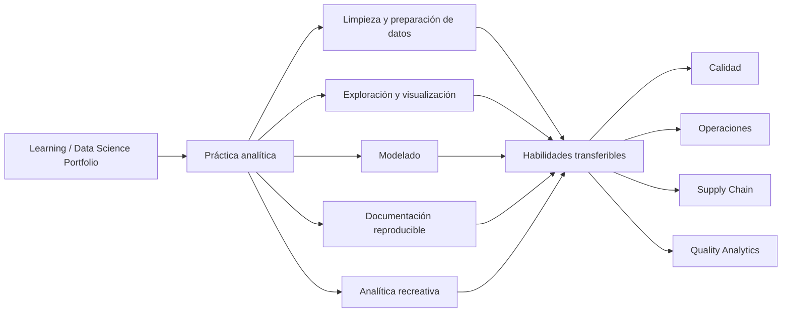
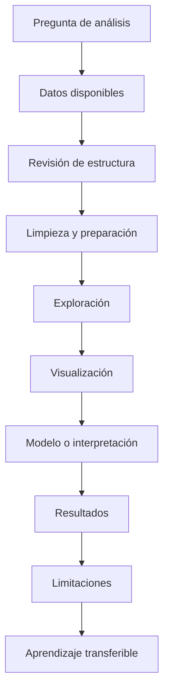

# Learning / Data Science Portfolio

Portafolio de aprendizaje aplicado, análisis de datos y proyectos exploratorios para fortalecer capacidades en analítica, modelado, visualización y toma de decisiones basada en evidencia.

Este repositorio documenta práctica técnica y evolución analítica. No compite con la línea principal de Quality Analytics; la complementa mostrando habilidades transferibles hacia calidad, operaciones, mejora continua y supply chain.

El foco no es presentar todos los proyectos como productos finales. El foco es mostrar aprendizaje aplicado, pensamiento analítico, manejo de datos y documentación reproducible.

---

## Rol dentro del ecosistema

Esta línea funciona como laboratorio de aprendizaje público. Ayuda a mostrar cómo se desarrollan capacidades analíticas que luego pueden aplicarse a problemas operativos más específicos.

---

## Qué demuestra

| Capacidad | Cómo se evidencia | Aplicación transferible |
|---|---|---|
| Exploración de datos | análisis descriptivo y revisión de patrones | entender comportamiento de procesos o mercados |
| Limpieza y preparación | transformación de datasets | construir bases confiables para indicadores |
| Visualización | gráficos, comparaciones y tableros simples | comunicar hallazgos a usuarios no técnicos |
| Modelado | clasificación, predicción o comparación de modelos | evaluar señales, riesgos o patrones operativos |
| Documentación | notebooks y repositorios explicativos | hacer el análisis revisable y reutilizable |
| Publicación web | proyectos personales y sitios públicos | comunicar análisis fuera del entorno técnico |
| Aprendizaje técnico | proyectos en dominios diversos | ampliar criterio analítico sin exponer datos sensibles |

---

## Repositorios incluidos

| Área | Repositorio | Uso principal |
|---|---|---|
| Data mining / aprendizaje académico | [data_mining_galileo](https://github.com/fjgonzalezmgt/data_mining_galileo) | Proyecto académico de minería de datos, análisis aplicado y práctica estructurada |
| Machine learning / clasificación | [kidney_stones](https://github.com/fjgonzalezmgt/kidney_stones) | Proyecto exploratorio de modelado predictivo con datos de salud |
| Análisis deportivo / visualización | [F1-Results](https://github.com/fjgonzalezmgt/F1-Results) | Exploración y visualización de resultados de Fórmula 1 |
| Análisis deportivo / eventos | [WCUP2026](https://github.com/fjgonzalezmgt/WCUP2026) | Análisis y estructuración de datos relacionados con Mundial 2026 |
| Shiny / aplicaciones exploratorias | [shiny_apps](https://github.com/fjgonzalezmgt/shiny_apps) | Práctica con interfaces analíticas y aplicaciones Shiny |
| Utilidades / práctica técnica | [wheel](https://github.com/fjgonzalezmgt/wheel) | Práctica técnica o exploración de componentes reutilizables |

---

## Proyectos personales de analítica recreativa

Estos proyectos funcionan como laboratorio personal para practicar análisis, visualización, publicación web y comunicación de datos usando temas de entretenimiento, deportes, gaming y simulación.

| Proyecto | Sitio / repositorio | Qué demuestra |
|---|---|---|
| Gamer Insight Analytics | [gamerinsightanalytics.com](https://gamerinsightanalytics.com/) | Sitio personal sobre gaming, cultura digital, sports analytics y sim racing |
| World Cup 2026 Analytics | [Gamer Insight Analytics](https://gamerinsightanalytics.com/) | Análisis recreativo de datos deportivos y visualización pública |
| F1 Cockpit / Sim Racing | [Gamer Insight Analytics](https://gamerinsightanalytics.com/) | Exploración personal de simulación, setup, experiencia y posible análisis de datos de carrera |

No forman parte del núcleo profesional de Quality Analytics. Su función es mostrar curiosidad analítica, práctica pública con datos no confidenciales y capacidad de comunicar proyectos fuera del entorno técnico tradicional.

---

## Flujo de aprendizaje aplicado

La parte más importante no es solo producir un resultado. La parte más importante es documentar qué se aprendió y qué puede transferirse a problemas profesionales reales.

---

## Principios de documentación

Cada proyecto debería dejar claro:

1. **Contexto:** qué problema, dataset o tema se explora.
2. **Objetivo:** qué pregunta se intenta responder.
3. **Datos:** qué fuente o estructura se utiliza.
4. **Método:** qué análisis, modelo o visualización se aplica.
5. **Resultados:** qué se encontró.
6. **Limitaciones:** qué no puede concluirse.
7. **Aprendizaje transferible:** qué habilidad puede aplicarse después en calidad, operaciones o analítica profesional.

---

## Qué no busca hacer

Este portafolio no busca:

- presentarse como una suite de productos terminados;
- reemplazar el portafolio principal de calidad y operaciones;
- competir como colección genérica de notebooks;
- mostrar volumen por encima de criterio;
- ocultar que algunos repositorios son exploratorios.

Su función es mostrar aprendizaje aplicado y evolución técnica.

---

## Relación con Quality Analytics

Las habilidades desarrolladas aquí fortalecen las demás líneas del ecosistema:

- análisis exploratorio para entender datos operativos;
- visualización para comunicar patrones;
- modelado para evaluar señales y riesgos;
- documentación reproducible para sostener aprendizaje técnico;
- interfaces analíticas para acercar análisis a usuarios no técnicos;
- publicación web para comunicar análisis a audiencias más amplias.

---

## Parte del ecosistema Quality Analytics

- [Biblioteca Técnica Quality Analytics](https://github.com/fjgonzalezmgt/fjgonzalezmgt/blob/main/TECHNICAL_LIBRARY.md)
- [Quality Analytics Toolkit](https://github.com/fjgonzalezmgt/Quality-Analytics-Toolkit)
- [QMS Intelligence / AI for Quality](https://github.com/fjgonzalezmgt/QMS-Intelligence-AI-for-Quality)
- [Operational Analytics & Automation](https://github.com/fjgonzalezmgt/Operational-Analytics-Automation)
